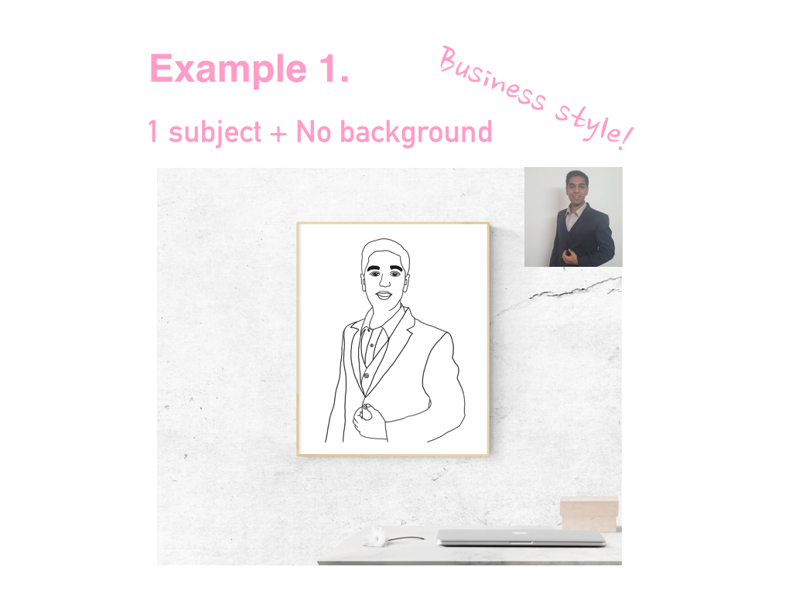

# Custom Art from Photo

Whether you are looking for an artistic portrait of your loved ones, or a special gift for your friends, this shop is for you!

Message me with a nice photo and I'll turn it into an **HD hand-drawn line portrait in a digital format (say, PNG)**. You can then print it, frame it, light up your home!


<div class="image-row">
			<div class="image-set">
				<a class="example-image-link" href="./gallery/ex1.jpg" data-lightbox="example-set" title="Click the right/left side to move forward/backward."></a>
				<a class="example-image-link" href="./gallery/ex2.jpg" data-lightbox="example-set" title="Click the right/left side to move forward/backward."></a>
				<a class="example-image-link" href="./gallery/ex3.jpg" data-lightbox="example-set" title="Click the right/left side to move forward/backward."></a>
				<a class="example-image-link" href="./gallery/ex4.jpg" data-lightbox="example-set" title="Click the right/left side to move forward/backward."></a>
				<a class="example-image-link" href="./gallery/ex5.jpg" data-lightbox="example-set" title="Click the right/left side to move forward/backward."></a>
				<a class="example-image-link" href="./gallery/ex6.jpg" data-lightbox="example-set" title="Click the right/left side to move forward/backward."></a>
			</div>
</div>
    

# How to Order

**FYI: <span style="color:red">You don't have to pay until you are satisfied with the line portrait!</span>**

## <span style="color:#0076bf"> Place an Order in Two Steps </span>

**Step 1** - <span style="color:red"> Email me the photo(s) you'd like me to work on. My email is: </span> <span style="color:#ff62b1"> greatsandyeagle@gmail.com </span>
**Step 2** - Chill and wait for my reply! A confirmation will be sent within 24 hours. If you do NOT receive a reply from me within 24hrs, double check if my email address is entered correctly. Feel free to contact me for any problems.

## <span style="color:#0076bf"> Preview the artwork and Purchase if you like it </span>
- Within 2 days after the photo is received, I will send you part of the line art(say, 50%) that I complete.    
- If you are satisfied with it, start to pay. Otherwise, just let me know how you want me to improve it.    
- **Payment: PayPal**
- After the payment is received, I will send you the full image in the format you choose (default: PNG).

The default setting is: black line + white background. You are free to choose line color, background color, file formats, etc. Just let me know!

# What You'll Get
High-resolution (300dpi) PNG files:   
- One with the background color you choose (default: white).    
- One with transparent background.     
- If you request several color options, you'll then get more files (with no extra cost!).

# Price 
See the list below for the price for a SINGLE photo that you send. The price depends on the complexity of rendering. We can discuss what to include in the portrait and customize a price for you.   
- 1 subject + No/Simple/Fancy background: $7/$9/$11
- 2 subjects + No/Simple/Fancy background: $11/$13/$15
- 3 subjects + No/Simple/Fancy background: $15/$17/$19
- 4 subjects + No/Simple/Fancy background: $19/$21/$23
- N subjects + No/Simple/Fancy background: $(4N+3)/$(4N+5)/$(4N+7)
- Online Meeting Style (see Example 6 in the gallery above): $33

# Turnaround 
Within 48 hours(aka 2 days) from the time I receive your photo. Make sure my email address is entered correctly!
Speed-up service is available. Just let me know!

#  Questions? 
Price? Color? File format? Whenever you have a question, feel free to contact me at:
<span style="color:blue"> greatsandyeagle@gmail.com </span>


<!-- ```markdown
[Link](url) and 
``` -->
